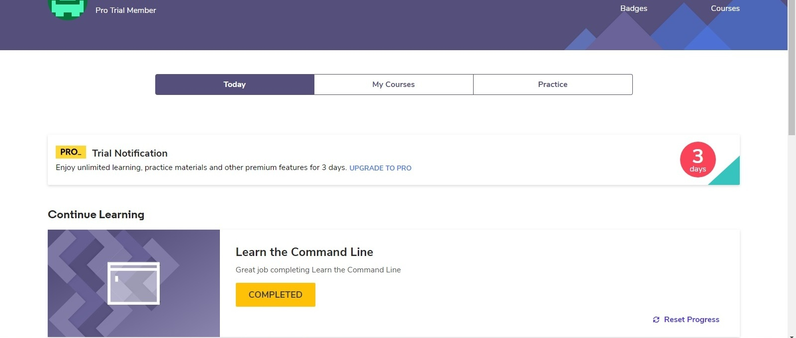
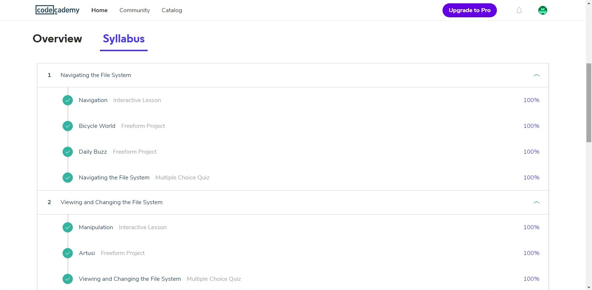
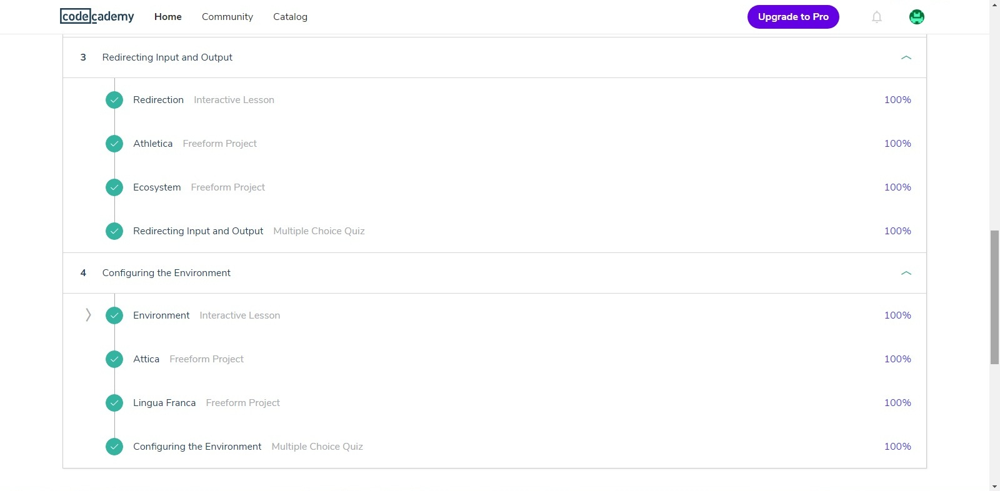
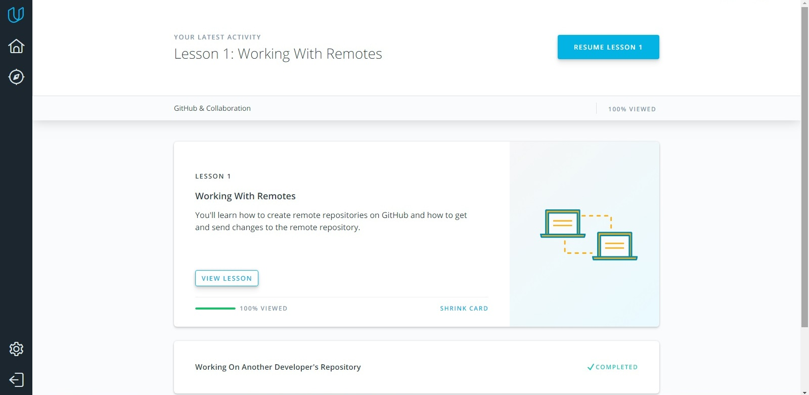
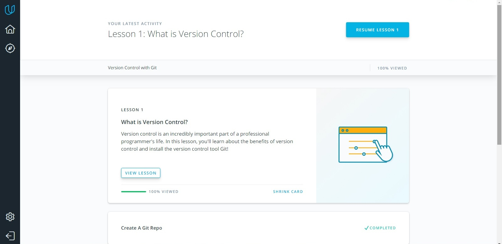

# kottans-frontend

## Task 0
Got profound basic knowledge about capabilities and advantages of git.
Definitely will use it in my future projects

## Linux CLI, and HTTP
- [x] *what was new*   
I realy seldom work with terminal so most of commands were new for me.

- [x] *what intend to use in future*    
hope that navigating the file system and manipulating files through command line will be usefull.

- [x] *successfully finished course*   

## Git Collaboration
- [x] *what was new*   
Review commits using filter by keywords and add tags to commits is new and interesting features
- [x] *what intend to use in future*    
 Amend. It looks like really cool and useful thing
- [x] *successfully finished course*
   
   

