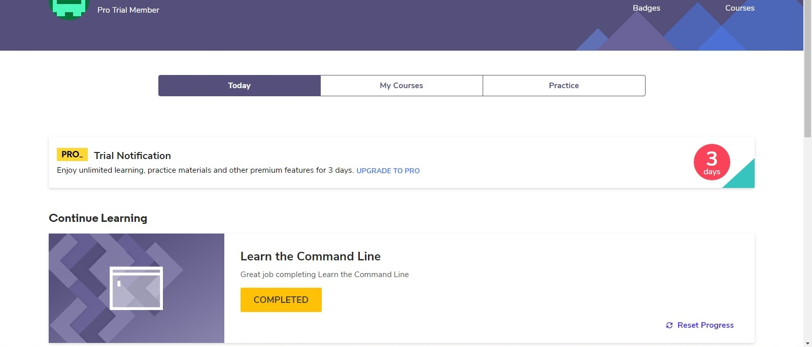

# kottans-frontend

## Task 0
Got profound basic knowledge about capabilities and advantages of git.
Definitely will use it in my future projects

## Linux CLI, and HTTP
- [x] what was new 
I realy seldom work with terminal so most of commands were new for me.

- [x] what intend to use in future 
hope that navigating the file system and manipulating files through command line will be usefull.

[command_line_2](task_linux_cli/command_line_2.jpg)
[command_line_3](task_linux_cli/command_line_3.jpg)