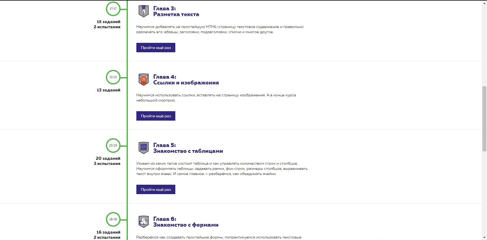
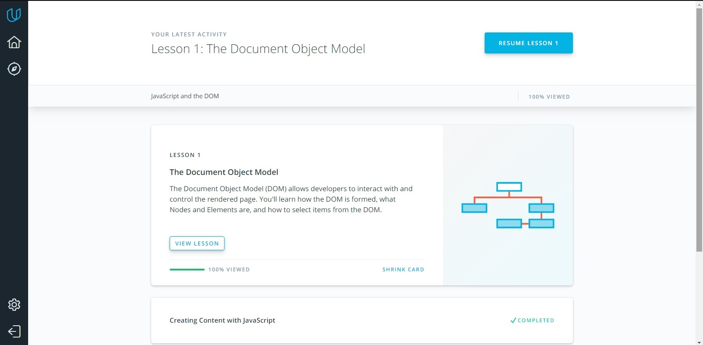
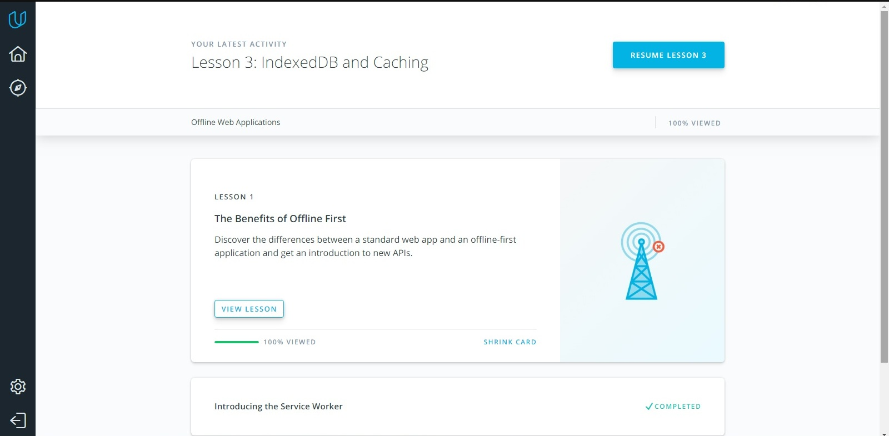

# kottans-frontend

## Task 0
Got profound basic knowledge about capabilities and advantages of git.
Definitely will use it in my future projects

## Linux CLI, and HTTP
- [x] *what was new*   
I realy seldom work with terminal so most of commands were new for me.

- [x] *what intend to use in future*    
hope that navigating the file system and manipulating files through command line will be usefull.

- [x] *successfully finished course*   

## Git Collaboration
- [x] *what was new*   
Review commits using filter by keywords and add tags to commits is new and interesting features
- [x] *what intend to use in future*    
 Amend. It looks like really cool and useful thing
- [x] *successfully finished course*
   
   

## Intro to HTML and CSS
   
   
   
  

## Responsive Web Design
I've never used flexbox before and it looks very fascinating. Also was very interesting to know about different responsive patterns.
Probably will use both those things in future but it depends on project. 
   
   

## JS Basics
Finally some practice! :)

   

## DOM

   

[Demo](https://sergsenras.github.io/kottans-frontend/task_js_dom/js-dom/) |
[Code base](https://github.com/SergSenras/kottans-frontend/tree/master/task_js_dom/js-dom)
Reviewed and approved by @OleksiyRudenko and @A-Ostrovnyy 

## A Tiny JS World
[Demo](https://sergsenras.github.io/kottans-frontend/task_tiny_js_world/) |
[Code base](https://github.com/SergSenras/kottans-frontend/tree/master/task_tiny_js_world)
Reviewed and approved by @OleksiyRudenko

## Object Oriented JS
    
    

[Demo](https://sergsenras.github.io/frogger-game/) |    
[Code base](https://github.com/SergSenras/frogger-game)     
Reviewed and approved by @OleksiyRudenko

## OOP Exercise
[Demo](https://sergsenras.github.io/tiny-js-world-oop/) |    
[Code base](https://github.com/SergSenras/SergSenras.github.io/tree/master/tiny-js-world-oop)     
Reviewed and approved by @OleksiyRudenko

## Offline Web Applications

## Memory Pair Game
[Demo](https://sergsenras.github.io/memory-pair-game/) |    
[Code base](https://github.com/SergSenras/SergSenras.github.io/tree/master/memory-pair-game)     
Reviewed and approved by @AMashoshyna

<!-- 
## Friends App
[Demo](https://sergsenras.github.io/friends-app/) |    
[Code base](https://github.com/SergSenras/SergSenras.github.io/tree/master/friends-app)     
Reviewed and approved by @AMashoshyna
-->

